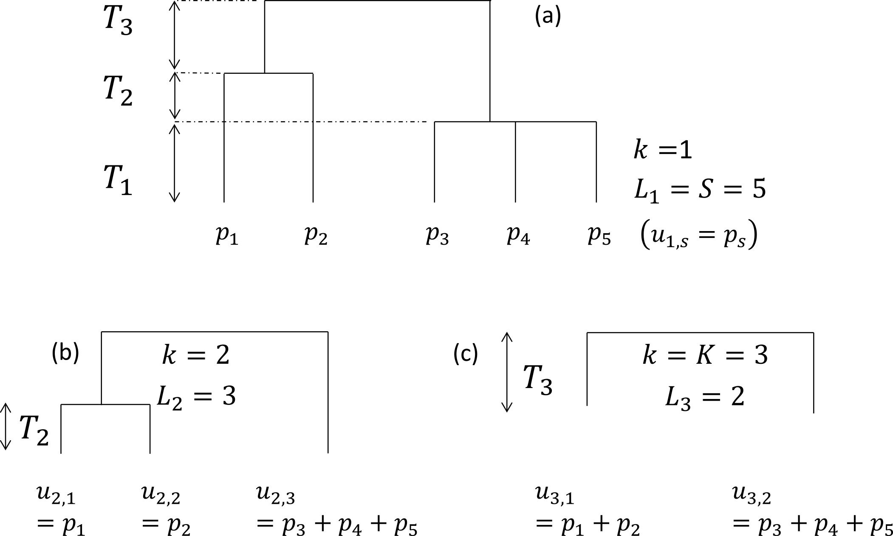

<!-- dynamically load mathjax for compatibility with self-contained -->
<script>
  (function () {
    var script = document.createElement("script");
    script.type = "text/javascript";
    script.src  = "https://cdn.bootcss.com/mathjax/2.7.1/MathJax.js?config=TeX-MML-AM_CHTML";
    if (location.protocol !== "file:" && /^https?:/.test(script.src))
      script.src  = script.src.replace(/^https?:/, '');
    document.getElementsByTagName("head")[0].appendChild(script);
  })();
</script>

```{r global_options, include=FALSE}
# R output pre blocks are styled by default to indicate output
knitr::opts_chunk$set(comment = NA, cache = TRUE)
set.seed(97310)

# shorthand for rd_link() - see ?packagedocs::rd_link for more information
rdl <- function(x) packagedocs::rd_link(deparse(substitute(x)))
```

_entropart_ is a package for _R_ designed to estimate diversity based on HCDT entropy or similarity-based entropy. 
A short introduction to its use is in the first section of this vignette (_Introduction_). 
The second section is the reference guide and the last one focuses on the plylogenetic tree formats used in the package.

# Introduction

The _entropart_ package allows estimating biodiversity according to the framework based on HCDT entropy, the correction of its estimation-bias [@Grassberger1988; @Chao2003; @Chao2015] and its transformation into equivalent numbers of species [@Hill1973; @Jost2006; @Marcon2014a].

Phylogenetic or functional diversity [@Marcon2014b] can be estimated, considering phyloentropy as the average species-neutral diversity over slices of a phylogenetic or functional tree [@Pavoine2009]. 

Similarity-based diversity [@Leinster2012] can be used to estimate [@Marcon2014e] functional diversity from a similarity or dissimilarity matrix between species without requiring building a dendrogram and thus preserving the topology of species  [@Pavoine2005a; @Podani2007].

The classical diversity estimators (Shannon and Simpson entropy) can be found in many R packages. 
_vegetarian_ [@Charney2009] allows calculating Hill numbers and partitioning them according to Jost's framework. 
Bias correction is never available except in the _EntropyEstimation_ [@Cao2014] package which provides the Zhang and Grabchak's estimators of entropy and diversity and their asymptotic variance (not included in _entropart_). 


## Estimating the diversity of a community

### Community data

Community data is a numeric vector containing abundances of species (the number of individual of each species) or their probabilities (the proportion of individuals of each species, summing to 1).

Example data is provided in the dataset `paracou618`.
Let's get the abundances of tree species in the 1-ha tropical forest plot #18 from Paracou forest station in French Guiana:

```{r LoadParacou18}
library("entropart")
data("Paracou618")
N18 <- Paracou618.MC$Nsi[, "P018"]
```


The data in `Paracou618.MC` is a `MetaCommunity`, to be discovered later.
`N18` is a vector containing the abundances of 425 tree species, among them some zero values.
This is the most simple and common format to provide data to estimate diversity.
It can be used directly by the functions presented here, but it may be declared explicitely as an abundance vector to plot it, and possibly fit a well-known, e.g. log-normal [@Preston1948], distribution of species abundance (the red curve):

```{r PlotN18}
Abd18 <- as.AbdVector(N18)
plot(Abd18, Distribution="lnorm")
```

The parameters of the fitted distribution (here: mean and standard deviation) are returned by the function.

Abundance vectors can also be converted to probability vectors, summing to 1:

```{r PN18}
P18 <- as.ProbaVector(N18)
```

The `rCommunity` function allows drawing random communities:

```{r rCommunity}
rc <- rCommunity(1, size=10000, Distribution = "lseries", alpha = 30)
plot(rc, Distribution="lseries")
```

The Whittaker plot of a random log-series [@Fisher1943] distribution of 10000 individuals simulated with parameter $\alpha=30$ is produced.


### Diversity estimation

The classical indices of diversity are richness (the number of species), Shannon's and Simpson's entropies:

```{r IndicesP}
Richness(P18)
Shannon(P18)
Simpson(P18)
```

When applied to a probability vector (created with `as.ProbaVector` or a numeric vector summing to 1), no estimation-bias correction is applied: this means that indices are just calculated by applying their definition function to the probabilities (that is the plugin estimator).

When abundances are available (a numeric vector of integer values or an object created by `as.ProbaVector`), several estimators are available [@Marcon2015a] to address unobserved species and the non-linearity of the indices:

```{r IndicesAbd}
Richness(Abd18)
Shannon(Abd18)
Simpson(Abd18)
```

The best available estimator is chosen by default: its name is returned.

Those indices are special cases of the Tsallis entropy [-@Tsallis1988] or order $q$ (respectively $q=0,1,2$ for richness, Shannon, Simpson):

```{r Tsallis}
Tsallis(Abd18,q=1)
```

Entropy should be converted to its effective number of species, i.e. the number of species with equal probabilities that would yield the observed entropy, called @Hill1973 numbers or simply diversity [@Jost2006].

```{r Diversity}
Diversity(Abd18,q=1)
```

Diversity is the deformed exponential of order $q$ of entropy, and entropy is the deformed logarithm of of order $q$ of diversity:

```{r lnq}
(d2 <- Diversity(Abd18,q=2))
lnq(d2, q=2)
(e2 <-Tsallis(Abd18,q=2))
expq(e2, q=2)
```

Diversity can be plotted against its order to provide a diversity profile. Order 0 corresponds to richness, 1 to Shannon's and 2 to Simpson's diversities:

```{r DiversityProfile}
DP <- CommunityProfile(Diversity, Abd18)
plot(DP)
```

If an ultrametric dendrogram describing species' phylogeny (here, a mere taxonomy with family, genus and species) is available, phylogenetic entropy and diversity  [@Marcon2014b] can be calculated:

```{r PhyloDiversity}
summary(PhyloDiversity(Abd18,q=1,Tree=Paracou618.Taxonomy))
```

With a Euclidian distance matrix between species, similarity-based diversity [@Leinster2012; @Marcon2014e] is available:

```{r SBDiversity}
# Prepare the similarity matrix
DistanceMatrix <- as.matrix(Paracou618.dist)
# Similarity can be 1 minus normalized distances between species
Z <- 1 - DistanceMatrix/max(DistanceMatrix)
# Calculate diversity of order 2
Dqz(Abd18, q=2, Z)
```

Profiles of phylogenetic diversity and similarity-based diversity are obtained the same way.
`PhyloDiversity` is an object with a lot of information so an intermediate function is necessary to extract its `$Total` component:

```{r PDiversityProfile}
sbDP <- CommunityProfile(Dqz, Abd18, Z=Z)
pDP <- CommunityProfile(function(X, ...) PhyloDiversity(X, ...)$Total, Abd18, Tree=Paracou618.Taxonomy)
plot(pDP)
```


## Estimating the diversity of a meta-community

### Meta-community data

A meta-community is an object defined by the package.
It is a set of communities, each of them decribed by the abundance of their species and their weight.
Species probabilities in the meta-community are by definition the weighted average of their probabilities in the communities.

The easiest way to build a meta-community consists of preparing a dataframe whose columns are communities and lines are species, and define weights in a vector (by default, all weights are equal):

```{r MetaCommunitydf}
library("entropart")
(df <- data.frame(C1 = c(10, 10, 10, 10), C2 = c(0, 20, 35, 5), C3 = c(25, 15, 0, 2), row.names = c("sp1", "sp2", "sp3", "sp4")))
w <- c(1, 2, 1)
```


The `MetaCommunity` function creates the meta-community.
It can be plotted:

```{r MetaCommunityMC}
MC <- MetaCommunity(Abundances = df, Weights = w)
plot(MC)
```

Each shade of grey represents a species.
Heights correspond to the probability of species and the width of each community is its weight.

`Paracou618.MC` is an example meta-community provided by the package.
It is made of two 1-ha communities (plots #6 and #18) of tropical forest.

### Diversity estimation

High level functions allow computing diversity of all communities ($\alpha$ diversity), of the meta-community ($\gamma$ diversity), and $\beta$ diversity, i.e.\ the number of effective communities (the number of communities with equal weights and no common species that would yield the observed $\beta$ diversity).

The `DivPart` function calculates everything at once, for a given order of diversity $q$:

```{r DivPart}
p <- DivPart(q = 1, MC = Paracou618.MC)
summary(p)
```

The $\alpha$ diversity of communities is `r round(p$TotalAlphaDiversity, 0)` effective species. $\gamma$ diversity of the meta-community is `r round(p$GammaDiversity, 0)` effective species. $\beta$ diversity is `r round(p$TotalBetaDiversity, 2)` effective communities, i.e. the two actual communities are as different from each other as `r round(p$TotalBetaDiversity, 2)` ones with equal weights and no species in common.

The `DivEst` function decomposes diversity and estimates confidence interval of $\alpha$, $\beta$ and $\gamma$ diversity following @Marcon2012a. 
If the observed species frequencies of a community are assumed to be a realization of a multinomial distribution, they can be drawn again to obtain a distribution of entropy.

```{r DivEst}
de <- DivEst(q = 1, Paracou618.MC, Simulations = 100)
plot(de)
```

The result is a `Divest` object which can be summarized and plotted.

`DivProfile` calculates diversity profiles. 
The result is a `DivProfile` object which can be summarized and plotted.

```{r DivProfile}
dp <- DivProfile(, Paracou618.MC)
plot(dp)
```

Plot #18 can be considered more diverse than plot #6 because their profiles (top right figure, plot #18 is the dotted red line, plot #6, the solid black one) do not cross [@Tothmeresz1995]: its diversity is systematically higher. The shape of the $\beta$ diversity profile shows that the communities are more diverse when their dominant species are considered.

The bootstrap confidence intervals of the values of diversity [@Marcon2012a; @Marcon2014a] are calculated if `NumberOfSimulations` is not 0.

`DivPart`, `DivEst` and `DivProfile` use plugin estimators by default.
To force them to apply the same estimators as community functions, the argument `Biased = FALSE` must be entered.
They compute Tsallis entropy and Hill numbers by default.
A dendrogram in the argument `Tree` or a similarity matrix in the argument `Z` will make them calculate phylogenetic diversity or similarity-based diversity.


# Reference guide

Diversity measurement can be done through a quite rigorous framework based on entropy, i.e. the amount of uncertainty calculated from the frequency distribution of a community [@Patil1982; @Jost2006; @Marcon2014a]. 
Tsallis entropy, also known as HCDT entropy [@Havrda1967; @Daroczy1970; @Tsallis1988], is of particular interest [@Jost2006; @Marcon2014a] namely because it gathers the number of species, Shannon [-@Shannon1948] and Simpson [-@Simpson1949] indices of diversity into a single framework.
Interpretation of entropy is not straightforward but one can easily transform it into Hill numbers [@Hill1973] which have many desirable properties [@Jost2007]: mainly, they are the number of equally-frequent species that would give the same level of diversity as the data.

@Marcon2014b generalized the duality of entropy and diversity, deriving the relation between phylogenetic or functional diversity [@Chao2010] and phylogenetic or functional entropy (we will write _phylodiversity_ and _phyloentropy_ for short), as introduced by @Pavoine2009. 
Special cases are the well-known PD [@Faith1992] and FD [@Petchey2002] indices and Rao's [-@Rao1982] quadratic entropy. 
The same relation holds between Ricotta and Szeidl's entropy of a community [@Ricotta2006] and similarity-based diversity [@Leinster2012].

The _entropart_ package for R [@R] enables calculation of all these measures of diversity and entropy and their partitioning.

Diversity partitioning means that, in a given area, the $\gamma$ diversity $D_{\gamma}$ of all individuals found may be split into within ($\alpha$ diversity, $D_{\alpha}$) and between ($\beta$ diversity, $D_{\beta}$) local assemblages. 
$\alpha$ diversity reflects the diversity of individuals _in_ local assemblages whereas $\beta$ diversity reflects the diversity _of_ the local assemblages. 
@Marcon2014a derived the decomposition of Tsallis $\gamma$ entropy into its $\alpha$ and $\beta$ components, generalized to phylodiversity [@Marcon2014b] and similarity-based diversity [@Marcon2014e].

Estimators of diversity are biased because of unseen species and also because they are not linear functions of probabilities [@Marcon2014a]. 
$\alpha$ and $\gamma$ diversities are underestimated by naive estimators [@Chao2003; @Dauby2012]. 
$\beta$ diversity is severely biased too when sampling is not sufficient [@Beck2013]. 
Bias-corrected estimators of phylodiversity have been developed by @Marcon2014b. 
Estimators of similarity-based diversity were derived by @Marcon2014e. 
The package includes them all [@Marcon2014c].

In summary, the framework supported by the package is as follows. 
First, an information function is chosen to describe the amount of surprise brought by the observation of each individual.
In the simplest case of species-neutral diversity, it is just a decreasing function of probability: observing an individual of a rarer species brings more surprise.
Various information functions allow evaluating species-neutral, phylogenetic or functional entropy.
Surprise is averaged among all individuals of a community to obtain its entropy.
Entropy is systematically transformed into diversity for interpretation.
Diversity is an effective number of species, i.e. the number of equally-different and equally-frequent species that would give the same entropy as the data.
The average entropy of communities of an assemblage is $\alpha$ entropy, while the entropy of the assemblage is $\gamma$ entropy. 
Their difference is $\beta$ entropy.
After transformation, $\beta$ diversity is the ratio of $\gamma$ to $\alpha$ diversity.
It is an effective number of communities, i.e. the number of equally-weighted communities with no species in common (and where species are maximally distinct between communities) necessary to obtain the same diversity as the data.
Estimation-bias correction is more easily applied to entropy before transforming it into diversity.

This framework is somehow different from that of @Chao2014a who define $\alpha$ diversity in another way [see @Marcon2014b for a detailed comparison], such that $\alpha$ entropy is not the average surprise of an assemblage. 
They also propose a definition of functional diversity [@Chiu2014b] based in the information brought by pairs of individuals that is not supported in the package.

The successive sections of this paper presents the package features, illustrated by worked examples based on the data included in the package.


## Package organization

### Data

Most functions of the package calculate entropy or diversity of a community or of an assemblage of communities called a _meta-community_. 
Community functions accept a vector of probabilities or of abundances for species data. 
Each element of the vector contains the probability or the number of occurrences of a species in a given community. 
Meta-community functions require a particular data organization in a `MetaCommunity` object described here.

A `MetaCommunity` is basically a list. 
Its main components are `$Nsi`, a matrix containing the species abundances whose lines are species, columns are communities and `$Wi`, a vector containing community weights. 
Creating a `MetaCommunity` object is the purpose of the `MetaCommunity` function. 
Arguments are a dataframe containing the number of individuals per species (lines) in each community (columns), and a vector containing the community weights. 
The following example creates a `MetaCommunity` made of three communities of unequal weights with 4 species. 
The weighted average probabilities of occurrence of species and the total number of individuals define the meta-community as the assemblage of communities.

```{r MetaCommunity}
df <- data.frame(C1=c(10, 10, 10, 10), C2=c(0, 20, 35, 5), C3=c(25, 15, 0, 2))
row.names(df) <- c("sp1", "sp2", "sp3", "sp4")
df
w <- c(1, 2, 1)
MC <- MetaCommunity(Abundances=df, Weights=w)
plot(MC)
```

Communities (named C1, C2 ad C3) are represented in the left part of the figure, the metacommunity to the right. 
Bar widths are proportional to community weights. 
Species abundances are represented vertically (4 species are present in the meta-community, only 3 of them in communities C2 and C3).

A meta-community is partitioned into several local communities (indexed by $i=1, 2,\dots, I$). 
$n_i$ individuals are sampled in community $i$. 
Let $s=1,\ 2,\dots ,S$ denote the species that compose the meta-community, $n_{s,i}$ the number of individuals of species $s$ sampled in the local community $i$, $n_s=\sum_i{n_{s,i}}$ the total number of individuals of species $s$, $n=\sum_s{\sum_i{n_{s,i}}}$ the total number of sampled individuals.
Within each community $i$, the probability $p_{s,i}$ for an individual to belong to species $s$ is estimated by $\hat{p}_{s,i}=n_{s,i}/{n_i}$. 
The same probability for the meta-community is $p_s$. 

Communities have a weight $w_i$, satisfying $p_s=\sum_i{w_i p_{s,i}}$. 
The commonly-used $w_i=n_i/n$ is a possible weight, but the weighting may be arbitrary (e.g. the sampled areas).
The component `$Ps` of a `MetaCommunity` object contains the probability of occurrence of each species in the meta-community, calculated this way:

```{r Ps}
MC$Ps
```

The number of individuals `$Ns` of a `MetaCommunity` is theoretically unknown, since communities are just samples of it.
The total number of individuals is `$N`.
For simplicity, it is set to the total number of individuals of all communities.
If community weights are their number of individuals, `$Ns` is just the sum of the numbers of individuals per species of communities.
Else, `$Ns` may contain non-integer values, respecting the probabilities `$Ps` and summing to `$N`.

A `MetaCommunity` can be summarized and plotted.

The package contains an example dataset containing the inventory of two 1-ha tropical forest plots in Paracou, French Guiana [@Marcon2012a]:

```{r data}
data("Paracou618")
summary(Paracou618.MC)
```

`Paracou618.MC` is a meta-community made of two communities named _P006_ and _P018_, containing `r round(Paracou618.MC$Nspecies, 0)` species (their name is *Family_Genus_Species*, abbreviated to 4 characters). 
The values of the abundance matrix are the number of individuals of each species in each community. 
Sample coverage will be explained later.

The dataset also contains a taxonomy and a functional tree. 
`Paracou618.Taxonomy` is an object of class `phylo`, defined in the package _ape_ [@Paradis2004], namely a phylogenetic tree. 
This example data is only a taxonomy, containing family, genus and species levels for the sake of simplicity. 
`Paracou618.Functional` is an object of class `hclust` containing a functional tree based on leaf, height, stem and seed functional traits [@Herault2007; @Marcon2014b]. 
The package also accepts any ultrametric tree of class `phylog`, from _ade4_ [@Dray2007] or `hclust`. 
`Paracou618.dist` is the distance matrix (actually a `dist` object) used to build the functional tree.

Numeric vectors containing species abundances (such as the `$Ns` component of `MetaCommunity`) or probabilities (such as `$Ps`) may be converted to abundance vectors (`AbdVector`) or probability vectors (`ProbaVector`) to clarify their content.
By default, the `as.AbdVector` function transforms abundance values into integer if they are not (the `$Ns` components of a `MetaCommunity` is typically not an integer vector if community weights are not proportional to their numbers of individuals):

```{r AbdVector}
data("Paracou618")
PAbd <- as.AbdVector(Paracou618.MC$Ns)
plot(PAbd)
```

the Paracou species distribution is plotted as a Rank-Abundance Curve (Whittaker plot).

The `as.ProbaVector` function transforms abundances to probabilities if necessary:
```{r ProbaVector}
PProba <- as.ProbaVector(Paracou618.MC$Ps)
```

`AbdVector` and `ProbaVector` objects both are `SpeciesDistribution` objects which can be plotted.


### Utilities

The deformed logarithm formalism [@Tsallis1994] is very convenient to manipulate entropies. 
The deformed logarithm of order $q$ is defined as:

$$\ln_q{x}=\frac{x^{1-q}-1}{1-q}$$

It converges to $\ln$ when $q\to 1$.

```{r lnqCurve}
curve(log(x), 0, 1, lty=1, ylab = expression(ln[q](x)))
curve(lnq(x, 0), 0, 1, lty = 2, add = TRUE)
curve(lnq(x, 2), 0, 1, lty = 3, add = TRUE)
curve(lnq(x, 3), 0, 1, lty = 4, add = TRUE)  
legend("bottomright", legend = c(expression(ln[0](x)), "ln(x)", expression(ln[2](x)), expression(ln[3](x))), lty = c(2, 1, 3, 4), inset=  0.02)
```

The figure shows the curves of $\ln_q{x}$ for different values of $q$ between 0 and 4 ($\ln_1{x}=\ln{x}$).

The inverse function of $\ln_q{x}$ is the deformed exponential:

$$e^x_q=[1+(1-q)x]^{\frac{1}{1-q}}$$

Functions of the package are `lnq(x, q)` and `expq(x, q)`.


## Species-neutral diversity

### Community functions

#### HCDT entropy

Species-neutral HCDT entropy of order $q$ of a community is defined as:

$$^q\!H=\frac{1-\sum_s{p^q_s}}{q-1}=-\sum_s{p^q_s}\ln_q{p_s}=\sum_s{p_s}\ln_q{\frac{1}{p_s}}$$
     
$q$ is the order of diversity (e.g.: 1 for Shannon). 
Entropy can be calculated by the `Tsallis` function. 
Paracou meta-community entropy of order 1 is:
```{r ShannonP6.1}
Tsallis(PProba, q = 1)
```

For convenience, special cases of entropy of order $q$ have a clear-name function: `Richess` for $q=0$, `Shannon` for $q=1$, `Simpson` for $q=2$.
```{r ShannonP6.2}
Shannon(PProba)
```

Entropy values have no intuitive interpretation in general, except for the number of species $^0\!H$ and Simpson entropy $^2\!H$ which is the probability for two randomly chosen individuals to belong to different species.
 
#### Sample coverage

A useful indicator of sampling quality is the sample coverage [@Good1953; @Chao1988; @Zhang2007], that is to say the probability for a species of the community to be observed in the actual sample. 
It equals the sum of the probability of occurrences of all observed species. 
Its historical estimator is [@Good1953]:

$$\hat{C}=1-\frac{S^1}{n}$$

$S^1$ is the number of singletons (species observed once) of the sample, and $n$ is its size. 
The estimator has been improved by taking into account the whole distribution of species [@Zhang2007]. 
The `Coverage` function calculates it, allowing to choose the estimator:

```{r Coverage}
Coverage(PAbd)
```

The sample coverage cannot be estimated from probability data: abundances are required.

Its interpretation is straightforward: some species have not been sampled. Their number is unknown but their total probability of occurence can be estimated accurately. Here, it is a bit less than 8%. From another point of view, the probability for an individual of the community to belong to a sampled species is $C$: 8% of them belong to missed species. The number of missed species may be estimated by `Richness` but this is not the point here. The sample coverage is the foundation of many estimators of entropy.

#### Bias corrected estimators

Correction of estimation bias is used to improve the estimation of entropy despite unobserved species and also mathematical issues [@Bonachela2008]. 
Bias-corrected estimators (often relying on sample coverage) are returned by functions whose names are prefixed by `bc`, such as `bcTsallis`. 
They are similar to the non-corrected ones but they use abundance data and propose several bias-correction techniques to select in the `Correction` argument. 
A _Best_ correction is calculated by default, detailed in the help file of each function.

```{r bcShannonP6.1}
bcTsallis(PAbd, q = 1)
```

The best correction for Tsallis entropy follows @Chao2015. It combines an unbiased estimator previously derived by @Zhang2014 and an estimate of the remaining bias.

All community functions such as `Tsallis` are actually generic methods that can handle several types of data the appropriate way: if the first argument of the function is a `ProbaVector` (or a numeric vector summing to 1), no bias correction is applied.
If it is an `AbdVector` (or an integer vector), the bias-corrected estimator is used (e.g. `bcTsallis`). Numeric vectors summing to more than 2 are considered as abundances but most bias corrections do not allow non-integer values and return a warning.

The different ways to use the functions are a matter of personal preference.
`bcTsallis` is equivalent to `Tsallis` with an abundance vector:

```{r bcShannonP6.3}
Tsallis(PAbd, q = 1)
```

whilst `Tsallis` with a probability vector does not allow bias correction:

```{r bcShannonP6.4}
Tsallis(PProba, q = 1)
```

Bias-corrected entropy is ready to be transformed into explicit diversity.


#### Effective numbers of species

Entropy should be converted into _true diversity_ [@Jost2007], i.e. effective number of species equal to @Hill1973 numbers:

$$^q\!D={\left(\sum_s{p^q_s}\right)}^{\frac{1}{1-q}}$$


This can be done by the deformed exponential function, or using directly the `Diversity` or `bcDiversity` functions (equal to the deformed exponential of order $q$ of `Tsallis` or `bcTsallis`)

```{r Diversity2}
expq(Tsallis(PAbd, q = 2), q = 2)
Diversity(PAbd, q = 2)
```

The effective number of species of the Paracou dataset is estimated to be
`r round(Diversity(PAbd, q = 2))`
after bias correction (rather than `r round(Diversity(PProba, q = 2))` without it).
It means that a community made of `r round(Diversity(Ns = PAbd, q = 2))` equally-frequent species has the same Simpson entropy as the actual one. 
This is much less than the actual 
`r round(Paracou618.MC$Nspecies, 0)` sampled species.
Simpson's entropy focuses on dominant species. 

#### Hurlbert's diversity

Hurlbert's index of diversity [@Hurlbert1971] of order $k$ is the expected number of species observed in a sample of size $k$.

$$_k\!S = \sum_{s}{\left[ 1-\left( 1-p_s \right)^k \right]}$$

Greater values of $k$ give more importance to rare species.

An unibiased estimator of $_k\!S$ has been provided by Hurlbert, for values of $k$ up to the sample size $n$:

$$_k\!\hat{S} = \sum_{s}{\left[ 1- \binom{n-n_s}{k} / \binom{n}{k} \right]}$$

The effective number of species $_k\!D$ can be found by solving the following equation [@Dauby2012]:

$$_k\!S  = {_k\!D} \left[1-{\left(1-\frac{1}{_k\!D}\right)}^k\right]$$

Hurlbert's index is calculated by the `Hurlbert` function. Its unbiased estimator is obtained by `bcHurlbert` (implicitly if an abundance vector is used).
Its effective number of species is caclulated by `HurlbertD` or `bcHurlbertD`.

```{r Hurlbert}
Hurlbert(PProba, k = 2)
Hurlbert(PAbd, k = 2)
HurlbertD(PAbd, k = 2)
```

Hurlbert's diversity of order 2 is identical to Simpson's diversity.


### Meta-community functions

Meta-community functions allow partitioning diversity according to Patil and Taillie's concept of diversity of a mixture [@Patil1982], i.e. $\alpha$ entropy of a meta-community is defined as the weighted average of community entropy, following @Routledge1979:

$$^q\!H_{\alpha}=\sum_i w_i \,^q_iH_{\alpha}$$

$^q_iH_{\alpha}$ is the entropy of community $i$:

$$^q_i\!H_{\alpha}=\frac{1-\sum_s{p^q_{s,i}}}{q-1} =-\sum_s{p^q_{s,i}}\ln_q{p_{s,i}} =\sum_s{p_{s,i}}\ln_q{\frac{1}{p_{s,i}}}$$

Jost's [-@Jost2007] definition of $\alpha$ entropy is not supported explicitly in the package since it only allows partitioning of equally weighted communities. 
In this particular case, both definitions are identical.

$\gamma$ entropy of the meta-community is defined as $\alpha$ entropy of a community. 
$\beta$ entropy, the difference between $\gamma$ and $\alpha$, is the generalized Jensen-Shannon divergence between the species distribution of the meta-community and those of communities [@Marcon2014a]:

$$^q\!H_{\beta} =^q\!H_{\gamma}-^q\!H_{\alpha} =\sum_s{p^q_{s,i}\ln_q\frac{p_{s,i}}{p_s}} =\sum_s{p_{s,i}\ln_q\frac{p_s}{p_{s,i}}}$$

$\beta$ entropy should be transformed into diversity, i.e. an effective number of communities:
$$^q\!D_{\beta}=e^{\frac{^q\!H_{\beta}}{1-(q-1)^q\!H_{\alpha}}}_q$$

#### Basic meta-community functions

These values can be estimated by the meta-community functions named `AlphaEntropy`, `AlphaDiversity`, `BetaEntropy`, `BetaDiversity`. 
They accept a `Metacommunity` and an order of diversity $q$ as arguments, and return an `MCentropy` or `MCdiversity` object which can be summarized and plotted. 
`GammaEntropy` and `GammaDiversity` return a number.
Estimation-bias corrections are applied by default:

```{r AlphaEntropy}
e <- AlphaEntropy(Paracou618.MC, q = 1)
summary(e)
```

The Shannon $\alpha$ entropy of the meta-community is `r round(e$Total, 2)`. 
It is the weighted average entropy of communities.

The estimation of the diversity of a meta-community whose numbers of individuals`$Ns` are not integer values can't be done with most corrections, which do require integers.
The Grassberger correction can be used.
Community data is pooled to obtain a global inventory whose sample coverage is estimated.
The Chao-Shen correction can also be applied based on this sample coverage and the actual `$Ps` values of the meta-community.
Finally, the _Best_ correction is the greater of the two values obtained by Chao-Shen and Grassberger [@Marcon2014a].


#### Diversity Partition of a metacommunity

The `DivPart` function calculates everything at once. 
Its arguments are the same but bias correction is not applied by default. 
It can be, using the argument `Biased = FALSE`, and the correction chosen by the argument`Correction`. 
It returns a `DivPart` object which can be summarized (entropy is not printed by `summary`) and plotted:

```{r DivPartPlot}
p <- DivPart(q = 1, MC = Paracou618.MC, Biased = FALSE)
summary(p)
p$CommunityAlphaEntropies
plot(p)
```

The $\alpha$ diversity of communities is `r round(p$TotalAlphaDiversity, 0)` effective species (it is the exponential of the entropy calculated previously). 
This is more than Simpson's diversity `r round(bcDiversity(Ns = PAbd, q = 2))` species, calculated above) because less frequent species are taken into account. 
$\gamma$ diversity of the meta-community is `r round(p$GammaDiversity, 0)` effective species. 
$\beta$ diversity is `r round(p$TotalBetaDiversity, 2)` effective communities, i.e. the two actual communities are as different from each other as `r round(p$TotalBetaDiversity, 2)` ones with equal weights and no species in common.

The figure is the plot of the diversity partition of the meta-community `Paracou618.MC`. 
The long rectangle of height 1 represents $\gamma$ diversity, equal to `r round(p$GammaDiversity, 0)` effective species. 
The narrower and higher rectangle has the same area: its horizontal size is $\alpha$ diversity (`r round(p$TotalAlphaDiversity, 0)` effective species) and its height is $\beta$ diversity (`r round(p$TotalBetaDiversity, 2)` effective communities).}


#### Diversity Estimation of a metacommunity

The `DivEst` function decomposes diversity and estimates confidence interval of $\alpha$, $\beta$ and $\gamma$ diversity following @Marcon2012a. 
If the observed species frequencies of a community are assumed to be a realization of a multinomial distribution, they can be drawn again to obtain a distribution of entropy.

```{r DivEstPlot}
de <- DivEst(q = 1, Paracou618.MC, Biased = FALSE, Correction = "Best", Simulations = 100)
summary(de)
plot(de)
```

The result is a `Divest` object which can be summarized and plotted.
On the figure of the diversity estimation of the meta-community `Paracou618.MC`, $\alpha$, $\beta$ and $\gamma$ diversity probability densities are plotted, with a 95% confidence interval.


The uncertainty of estimation is due to sampling: the distribution of the estimators corresponds to the simulated repetitions of sampling in the original multinomial distribution of species.
It ignores the remaining bias of the estimator, which is unknown. 
Yet, except for $q=2$, the corrected estimators _are_ biased (even though much less than the non-corrected ones), especially when $q$ is small. 
New estimators to reduce the bias are included in the package regularly.


#### Diversity Profile of a metacommunity

`DivProfile` calculates diversity profiles, i.e. the value of diversity against its order. 
The result is a `DivProfile` object which can be summarized and plotted.

```{r DivProfilePlot}
dp <- DivProfile(seq(0, 2, 0.2), Paracou618.MC, Biased = FALSE, NumberOfSimulations = 20)
summary(dp)
plot(dp)
```

The figure shows the diversity profile of the meta-community `Paracou618.MC`. 
Values are the number of effective species ($\alpha$ and $\gamma$ diversity) and the effective number of communities ($\beta$ diversity). 
Community P006 is represented by the solid line and community P018 by the dotted line.
$\alpha$ and $\gamma$ diversity decrease from $q=0$ (number of species) to $q=2$ (Simpson diversity) by construction.}

Small orders of diversity give more weight to rare species. 
P018 can be considered more diverse than P006 because their profiles (top right of the figure) do not cross [@Tothmeresz1995]: its diversity is systematically higher. 
The shape of the $\beta$ diversity profile shows that the communities are more diverse when their dominant species are considered.

The bootstrap confidence intervals of the values of diversity [@Marcon2012a; @Marcon2014a] are calculated if `NumberOfSimulations` is not 0.


#### Alternative functions

Beta entropy can also be calculated by a set of functions named after the community functions, such as `TsallisBeta`, `bcTsallisBeta`, `SimpsonBeta`, etc. which require two vectors of abundances or probabilities instead of a `MetaCommunity` object: that of the community and the expected one (usually that of the meta-community). 
Bias correction is currently limited to Chao and Shen's correction. 
The example below calculates the Shannon $\beta$ entropy of the first community of Paracou618 and the meta-community.

```{r ShannonBeta}
ShannonBeta(Paracou618.MC$Psi[, 1], PProba)
```

These functions are available for particular uses, when a `MetaCommunity` is not available or not convenient to use (e.g. simulations). 
Meta-community functions are preferred in general.


## Phylogenetic diversity

Phylogenetic or functional diversity generalizes HCDT diversity, considering the distance between species [@Marcon2014b]. 
Here, all species take place in an ultrametric phylogenetic or functional tree.



The tree is cut into slices, delimited by two nodes: the hypothetical tree of the figure (a) contains three slices, delimited by two nodes. 
The first slice starts at the bottom of the tree and ends at the first node. 
In slice $k$, $L_k$ leaves  are found. 
The length of slices is $T_k$. 
The probabilities of occurrence of the species belonging to branches that were below leaf $l$ in the original tree are summed to give the grouped probability $u_{k,l}$. 
Figure (b) focuses on slice 2. 
The tree without slice 1 is reduced to 3 leaves. 
Frequencies of collapsed species are $u_{k,l}$. 
Figure (c) shows slice 3 only.

HCDT entropy can be calculated in slice $k$:

$$^q_k{H}=-\sum_l{u_{k,l}} \ln_q{(1/u_{k,l})}$$

Then, it is summed over the tree slices. 
Phyloentropy can be normalized or not. 
We normalize it so that it does not depend on the tree height:

$$^q\overline{H}\left( T \right) = \sum^K_{k=1}{\frac{T_k}{T}{^q_k{\!H}}}$$

Unnormalized values are multiplied by the height of the tree, such as $^q\!\mathit{PD}(T)$ [@Chao2010].

Phyloentropy is calculated as HCDT entropy along the slices of the trees applying possible estimation-bias corrections, summed, possibly normalized, and finally transformed into diversity:

$$^q\overline{D}\left( T \right) = e^{^q\overline{H}\left( T \right)}_q$$


### Community functions

`PhyloEntropy` and the estimation-bias-corrected `bcPhyloEntropy` are the phylogenetic analogs of `Tsallis` and `bcTsallis`. 
They accept the same arguments plus an ultrametric tree of class `phylo`, `hclust` or `phylog` and `Normalize` a boolean to normalize the tree height to 1 (by default).

Phylogenetic diversity is calculated by `PhyloDiversity` or `bcPhyloDiversity` analogous to the species-neutral diversity functions `Diversity` and `bcDiversity`.

Results are either a `PhyloDiversity` or a `PhyloEntropy` object, which can be plotted and summarized.

```{r PhyloDiversityPlot}
phd <- bcPhyloDiversity(PAbd, q = 1, Tree = Paracou618.Taxonomy, Normalize = TRUE)
summary(phd)
plot(phd, main = "")
```

The figure shows the $\gamma$ phylodiversity estimation of the meta-community `Paracou618.MC`. 
The effective number of taxa of Shannon diversity is plotted against the distance from the leaves of the phylogenetic tree. 
Here, the tree is based on a rough taxonomy, so diversity of species, genera and families are the three levels of the curve.
The dotted line represents the value of phylodiversity.

The phylogenetic diversity of order 1 of the Paracou dataset is `r round(phd$Total, 0)` effective species: `r round(phd$Total, 0)` totally different species (only connected by the root of the tree) with equal probabilities would have the same entropy.
It can be compared to its species-neutral diversity: `r round(p$GammaDiversity, 0)` species. 
The latter is the diversity of the first slice of the tree. When going up the tree, diversity decreases because species collapse. On the figure, the diversity of the second slice, between $T=1$ and $T=2$, is that of genera (`r round(phd$Cuts[2], 0)` effective genera) and the last slice contains`r round(phd$Cuts[3], 0)` effective families. 
The phylogenetic entropy of the community is the average of the entropy along slices, weighted by the slice lengths. Diversity can not be averaged the same way.

A less trivial phylogeny would contain many slices, resulting in as many diversity levels with respect to $T$.


The `AllenH` function is close to `PhyloEntropy`: it also calculates phyloentropy but the algorithm is that of @Allen2009 for $q=1$ and that of @Leinster2012 for $q \ne 1$. 
It is much faster since it does not require calculating entropy for each slice of the tree but it does not allow estimation-bias correction. 
`ChaoPD` calculates phylodiversity according to @Chao2010, with the same advantages and limits compared to `PhyloDiversity`.

For convenience, `PDFD` and `Rao` functions are provided to calculate unnormalized phyloentropy of order 0 and 2.

### Meta-community functions

`DivPart`, `DivEst` and `DivProfile` functions return phylogenetic entropy and diversity values instead of species-neutral ones if a tree is provided in the arguments.

```{r PhylodivPart}
dp <- DivPart(q = 1, Paracou618.MC, Biased = FALSE, Correction = "Best", Tree = Paracou618.Taxonomy)
summary(dp)
```

The decomposition is interpreted as the species-neutral one: $\gamma$ diversity is `r round(dp$GammaDiversity, 0)` effective species, made of `r round(dp$TotalBetaDiversity, 1)` effective communities of `r round(dp$TotalAlphaDiversity, 0)` effective species.

Other meta-community functions, such as `AlphaEntropy` behave the same way:

```{r PhyloBetaEntropy}
summary(BetaEntropy(Paracou618.MC, q = 2, Tree = Paracou618.Taxonomy, Correction = "None", Normalize = FALSE))
```

Compare with Rao's `divc` computed by _ade4_:

```{r divc}
library("ade4")
divc(as.data.frame(Paracou618.MC$Wi), disc(as.data.frame(Paracou618.MC$Nsi), Paracou618.Taxonomy$Wdist))
```

The decomposition of the diversity of meta-communities with non integer `$Ns` starts with the estimation of $\gamma$ diversity.
The best estimator is found for each slice of the tree.
It is then used to estimate $\alpha$ diversity.


## Similarity-based diversity

@Leinster2012 introduced similarity-based diversity of a community $^qD^Z$. 
A matrix $\mathbf{Z}$ describes the similarity between pairs of species, defined between 0 and 1. 
A species ordinariness is its average similarity with all species (weighted by species frequencies), including similarity with itself (equal to 1). 
Similarity-based diversity is the reciprocal of the generalized average of order $q$ [@Hardy1952] of the community species ordinariness.

The `Dqz` function calculates similarity-based diversity. 
Its arguments are the vector of probabilities of occurrences of the species, the order of diversity and the similarity matrix $\mathbf{Z}$. 
The `bcDqz` function allows estimation-bias correction [@Marcon2014e].

This example calculates the $\gamma$ diversity of the meta-community Paracou. 
First, the similarity matrix is calculated from the distance matrix between all pairs of species as 1 minus normalized dissimilarity.

```{r Dqz}
DistanceMatrix <- as.matrix(Paracou618.dist)
Z <- 1 - DistanceMatrix/max(DistanceMatrix)
bcDqz(PAbd, q = 2, Z)
```

If $\mathbf{Z}$ is the identity matrix, similarity-based diversity equals HCDT diversity:

```{r DqzHCDT}
Dqz(PProba, q = 2, Z = diag(length(PProba)))
Diversity(PProba, q = 2)
```

Functional diversity of order 2 is only `r round(bcDqz(PAbd, q = 2, Z), 2)` effective species, which is very small compared to `r round(Diversity(PProba, q = 2), 0)` effective species for Simpson diversity. 
`r round(bcDqz(PAbd, q = 2, Z), 2)` equally-frequent species with similarity equal to 0 would have the same functional diversity as the actual community (made of `r round(Paracou618.MC$Nspecies, 0)` species). 
This means that species are very similar from a functional point of view. 
The very low values returned by $^qD^Z$ are questioned by @Chao2014a and discussed in depth by @Marcon2014e: the choice of the similarity matrix is not trivial.

The similarity-based entropy of a community $^qH^Z$ [@Leinster2012; Ricotta2006] has the same relations with diversity as HCDT entropy and Hill numbers. 
The `Hqz` function calculates it:

```{r Hqz}
Hqz(PProba, q = 2, Z)
lnq(Dqz(PProba, q = 2, Z), q = 2)
```

As species-neutral entropy, $^qH^Z$ has no straightforward interpretation beyond the average surprise of a community.

All meta-community functions can be used to estimate similarity-based diversity: argument `Z` must be provided:
```{r AlphaEntropyZ}
e <- AlphaEntropy(Paracou618.MC, q = 1, Z = Z)
summary(e)
```

The $\alpha$ functional entropy of the meta-community is the average entropy of communities.


## Advanced tools

The package comes with a set of tools to realize frequents tasks: run Monte-Carlo simulations on a community, quickly calculate its diversity profile, apply a function to a species distribution along a tree, and manipulate meta-communities.

### Random communities

The `rCommunity` function allows creating random communities. 
Their species probability distribution can be drawn in a well-known distribution (such as a log-normal one) or obtained from the data, just by dividing abundances by the total number of individuals [@Marcon2012a], or derived from a more sophisticated model by @Chao2015.
Finally, the specified number of communities are drawn in a multinomial distribution.

The log-normal [@Preston1948], the log-series [@Fisher1943], the geometric [@Motomura1932], and the broken-stick [@MacArthur1957] distributions can be simulated.

This example code draws a single community of 1000 individuals according to a log-normal distribution with 300 species. 
Many species are not observed in the 1000-individual sample: the observed number of species is shown, with an estimation of the actual number (which should be 300). 
The simulated community is plotted (a Whittaker plot), with its log-normal distribution fitted from the data. 
Estimated parameters can be compared to the original ones.

```{r rCommunityPlot}
rCommunity(n = 1, size = 1000, S=300, Distribution = "lnorm", sd=1) -> NsRef
Richness(as.ProbaVector(NsRef))
Richness(NsRef)
plot(NsRef, Distribution="lnorm")
```


### Entropy of Monte-Carlo simulated communities

The `EntropyCI` function is a versatile tool to simplify simulations. 
Simulated communities are obtained by random draws in a multinomial distribution of species and their entropy is calculated. 
The arguments of `EntropyCI` are an entropy function (any entropy function of the package accepting a vector of species abundances, such as `bcTsallis`), the number of simulations to run, the observed species frequencies and the method to obtain probabilities for the multinomial distribution (the same as that of `rCommunity`).

The result is a numeric vector containing the entropy value of each simulated community. 
Entropy can be finally transformed into diversity (but it is not correct to use a diversity function in simulations because the average simulated value must be calculated and only entropy can be averaged).

This example shows how to use the function. 
First, the distribution of the $\gamma$ HCDT entropy of order 1 (Shannon entropy) of the Paracou meta-community is calculated and transformed into diversity. 
Then, the actual diversity is calculated and completed by the 95\% confidence interval of the simulated values.

```{r EntropyCI}
SimulatedDiversity <- expq(EntropyCI(FUN = Tsallis, Simulations = 100, Ns = PAbd, q = 1), q = 1)
Diversity(PAbd, q = 1)
quantile(SimulatedDiversity, probs = c(0.025, 0.975))
```

These results are identical to those of the `DivEst` function but a single community can be addressed (`DivEst` requires a `MetaCommunity`).

### Diversity or Entropy Profile of a community

This function is used to calculate diversity or entropy profiles based on community functions such as `Tsallis` or `ChaoPD`. 
It is similar to `DivProfile` but does not require a `Metacommunity` for argument.
It can compute a bootstrap confidence envelope of the estimation of the profile, like `EntropyCI`.
It returns a `CommunityProfile` object which can be plotted.
Profiles can be added to an existing plot by the `CEnvelope` function.

This example evaluates bias correction on the diversity profile of the Paracou dataset. 
First, diversity profiles are calculated with and without bias correction. The corrected profile is calculated with its confidence envelope:

```{r CommunityProfile}
bcProfile <- CommunityProfile(Diversity, PAbd, NumberOfSimulations = 100)
Profile <- CommunityProfile(Diversity, PProba)
```

Then, they can be plotted altogether to obtain the $\gamma$ diversity profile of the the meta-community `Paracou618.MC`, without bias correction (dotted line) and with correction (solid line):

```{r CommunityProfileFig}
plot(bcProfile)
CEnvelope(Profile, lty=3)
legend("topright", c("Bias Corrected", "Biased"), lty=c(1,3), inset=0.02)
```

### Applying a Function over a Phylogenetic Tree

The `PhyloApply` function is used to apply an entropy community function (generally `bcTsallis`) along a tree, the same way `lapply` works with a list.

This example shows how to calculate Shannon entropy along the tree containing the taxonomy to obtain species, genus and family entropy:

```{r PhyloApply}
pa <- PhyloApply(Tree=Paracou618.Taxonomy, FUN=bcTsallis, NorP=PAbd)
summary(pa)
exp(pa$Cuts)
exp(pa$Total)
```


### Manipulation of meta-communities

Several meta-communities, combined in a list, can be merged two different ways.
The `MergeMC` function simplifies hierarchical partitioning of diversity: it considers the aggregated data of each meta-community as a community and builds an upper-level meta-community with them. 
The $\alpha$ entropy of the new meta-community is the weighted average $\gamma$ entropy of the original meta-communities.

`MergeC` combines the communities of several meta-communities to create a single meta-community containing them all. 
Last, `ShuffleMC` randomly shuffles communities accross meta-communities to allow simulations to test differences between meta-communities.

This example shows how to do this.
A first meta-community is created, weights of communities are proportional to their number of individuals:
```{r MC1}
(df <- data.frame(C1 = c(10, 10, 10, 10), C2 = c(0, 20, 35, 5),
  C3 = c(25, 15, 0, 2), row.names = c("sp1", "sp2", "sp3", "sp4")))
w <- colSums(df)
MC1 <- MetaCommunity(Abundances = df, Weights = w)
```

Then a second one:

```{r MC2}
(df <- data.frame(C1 = c(10, 4), C2 = c(3, 4), row.names = c("sp1", "sp5")))
w <- colSums(df)
MC2 <- MetaCommunity(Abundances = df, Weights = w)
```

They can be merged to obtain a single meta-community containing all original communities:

```{r MCMergeC}
mergedMC1 <- MergeC(list(MC1, MC2))
mergedMC1$Nsi
```

They can also be merged considering each of them as a community of a higher-level meta-community:

```{r MCMergeMC}
mergedMC2 <- MergeMC(list(MC1, MC2), Weights = sapply(list(MC1, MC2), function(x) (x$N)))
mergedMC2$Nsi
```

Hierarchical diversity partitioning can then be achieved:

```{r MCMergeHi}
dpAll <- DivPart(q=1, MC=mergedMC2)
summary(dpAll)
```

The $\gamma$ diversity of the top assemblage (MC1 and MC2) is `r round(dpAll$GammaDiversity, 2)` effective species, made of `r round(dpAll$TotalBetaDiversity, 2)` effective meta-communities of `r round(dpAll$TotalAlphaDiversity, 2)` effective species. 
The $\alpha$ diversity of each meta-community of the top assemblage is their $\gamma$ diversity when it is partitioned in turn:

```{r MCMergeLo1}
dpMC1 <- DivPart(q=1, MC=MC1)
summary(dpMC1)
```

The $\gamma$ diversity of MC1 is `r round(dpMC1$GammaDiversity, 2)` effective species, made of `r round(dpMC1$TotalBetaDiversity, 2)` effective meta-communities of `r round(dpMC1$TotalAlphaDiversity, 2)` effective species.
The same decomposition can be applied to MC2.


# Phylogenies

Several object classes can be used in _entropart_ to represent phylogenies and calculate phylogenetic diversity. They are detailed here.

## Formats used

Supported phylogenies are classes `phylo` from package _ape_, `phylog` from package _ade4_ and `hclust` from package _base_.

To optimize performance, a specific class `PPtree`, for "preprocessed trees", is introduced by the package: it is basically a list containing a `phylo` and an `hclust` representation of the phylogeny and preprocessed useful statistics.

The arguments `Tree` or `PhyloTree` used in phylogenetic diversity estimation functions of the package may be any of those formats.


## Conversion between classes

Let's start from an ultrametric distance matrix.
Three species are defined, with distance 1 between the first 2 and distance 2 between both and the last one.

```{r DistMatrix}
dSp <- matrix(c(0, 1, 2, 1, 0, 2, 2, 2, 0), nrow=3, byrow=TRUE)
row.names(dSp) <- colnames(dSp) <- c("A", "B", "C")
dSp
```

### hclust

An `hclust` object is created by UPGMA hierarchical clustering.

```{r hclust}
require("stats")
plot(hTree <- hclust(as.dist(dSp), method="average"), hang=-0.01, axes = F)
axis(2)
```

Node heights are stored in `$height`.

```{r hclust2}
hTree$height
```


### phylo

Conversion to a `phylo` object is straightforward.

```{r phylo}
require("ape")
plot(phyloTree <- as.phylo(hTree))
axis(1)
```

Edge lengths have been divided by 2 during the conversion, as documented in `?as.phylo.hclust`.
```{r phylo2}
phyloTree$edge.length
```

That does not suit our needs. In _entropart_, edge lengths are multiplied by 2 after conversion, so that `phylo`objects can be identical to other phylogenies. 

```{r phylo3}
phyloTree$edge.length <- 2*phyloTree$edge.length
plot(phyloTree)
axis(1)
```

### phylog

The last conversion is from `phylo` to `phylog`.

```{r phylog}
require("ade4")
plot(phylogTree <- hclust2phylog(hTree))
axis(1)
```

Edge lengths are not stored directly in `phylog` objects.
The `$droot` component keeps distances from tips to root.
The `$Wdist` component is a `dist` (half a distance matrix without the zero-diagonal) whose values are $d_{s,t}=\sqrt{2 \delta_{s,t}^2}$, where $\delta_{s,t}$ is the distance between species $s$ ant $t$.

```{r phylog2}
phylogTree$droot
phylogTree$Wdist^2/2
```

## Newick dendrograms

A Newick description of a dendrogram can be read into a `phylo` object.

```{r Newick}
NewickABC <- "(C:2,(A:1,B:1):1);"
plot(phyloABC <- ape::read.tree(text=NewickABC))
axis(1)
```


# References
